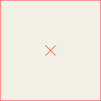
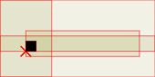
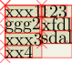
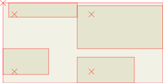
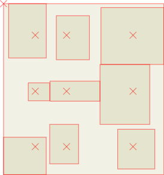
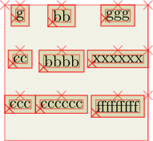
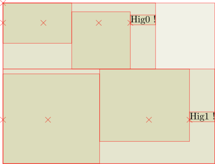

bruhat.render
-------------

First we set a debug flag so we can see the shape of every box

    Box.DEBUG = True

This is a box with fixed dimensions:

    box = EmptyBox(1., 1., 1., 1.)

This is a box with text:

    box = TextBox("Hey there!")

Horizontal box

    box = HBox("geghh xxde xyeey".split())

Overlay box:

    box = OBox([
        EmptyBox(.4, .1, 0., 2.2),
        EmptyBox(.3, 0., .5, 2.5),
        EmptyBox(1., .5, .5, .5),
        FillBox(.2, .2),
    ])

Horizontal box containing vertical boxes:

    box = HBox([
        VBox([TextBox(text) for text in "xxx1 ggg2 xxx3 xx4".split()]),
        VBox([TextBox(text) for text in "123 xfdl sdal".split()]),
    ])

A 2x2 tabular arrangement:

    box = TableBox([
        [EmptyBox(.4, .1, 0.2, 2.2), EmptyBox(.3, 1.2, .5, 2.5),],
        [EmptyBox(.8, .1, 0.4, 1.2), EmptyBox(.5, 0.4, .5, 1.5),]
    ])

A 3x3 table:

    def rnd(a, b):
        return (b-a)*random() + a

    a, b = 0.2, 1.0
    rows = []
    for row in range(3):
        row = []
        for col in range(3):
            box = EmptyBox(rnd(a,b), rnd(a,b), rnd(a,b), rnd(a,b))
            row.append(box)
        rows.append(row)

    box = TableBox(rows)

    rows = []
    for i in range(3):
        row = []
        for j in range(3):
            box = TextBox(choice("xbcgef")*(i+1)*(j+1))
            box = MarginBox(box, 0.1)
            box = AlignBox(box, "north")
            row.append(box)
        row.append(EmptyBox(bot=1.0))
        rows.append(row)
    box = TableBox(rows)

    a, b = 0.2, 2.0
    rows = []
    for row in range(2):
        boxs = []
        for col in range(2):
            top = rnd(a, b)
            bot = rnd(a, b)
            left = rnd(a, b)
            right = rnd(a, b)
            box = EmptyBox(top, bot, left, right)
            boxs.append(box)
        boxs.append(TextBox("Hig%d !"%row))
        #boxs.append(TextBox(r"$\to$"))
        box = HBox(boxs)
        rows.append(box)
    box = VBox(rows)

